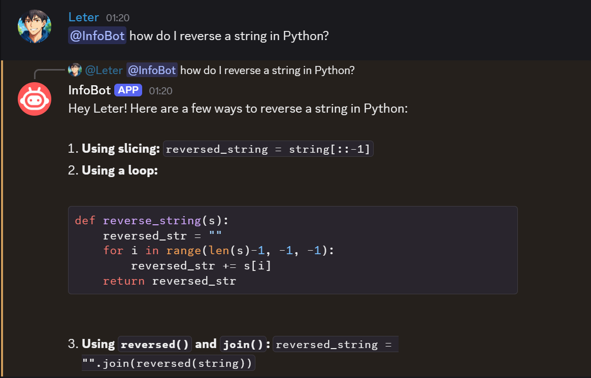
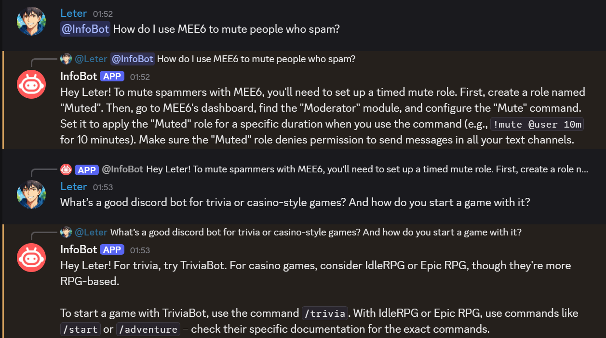

# **InfoBot**

**Ask anything, anytime.**

InfoBot is an intelligent Discord assistant. Mention it or reply to it in any server conversation, and it will respond with helpful, friendly, and context-aware replies. You can also use the slash commands to get assistance directly.

---

## ✨ Features

- 🧠 **AI-Powered Replies:** Mention `@InfoBot` or reply to its messages, and it will understand your context and respond accordingly.

- 💬 **Conversational Context:** Replies to threaded messages with prior context when possible.

- 🤖 **Slash Command Support:** Use `/ask`, `/write` and other commands to get assistance directly from the bot.

- 👤 **Personalized Responses:** Replies directly to users by name for a more natural experience.

- 🔍 **Smart Understanding:** Can answer questions, assist with decisions, or just chat casually.

- ⏳ **Typing Indicator:** Simulates human-like typing when generating responses.

- 📚 **Chat Summarization:** Use `/summarize_chat` to summarize recent convos with sender names and key points.

---

## 💡 Use Cases

InfoBot is versatile and can support nearly any type of Discord server. Whether you're managing a casual community, a developer hub, a study group, or a professional team — InfoBot brings AI assistance where it's needed most.

---

### 👥 Community & Chat Servers

- **Friendly Conversation:** Say hi or ask a random question — it’s always ready to talk.

- **Icebreakers & Games:** Get fun questions, trivia, or mini text games to liven up chat.

- **Q&A Helper:** Answer frequently asked questions about the server or topics.

- **Topic Suggestions:** Recommend trending or thoughtful conversation starters.

---

### 🧠 Education & Study Groups

- **Homework Help:** Explain school subjects like math, science, history, or literature.

- **Simplify Concepts:** Break down complex ideas into simpler terms.

- **Essay Drafting & Feedback:** Help outline or refine writing assignments.

- **Test Prep:** Generate sample quiz questions or flashcards.

---

### 💻 Developer & Tech Servers

- **Code Examples:** Ask for quick snippets or template functions.

- **Bug Explanations:** Paste errors or stack traces and get clarity.

- **Tool/Library Info:** Get overviews or usage of tech stacks and frameworks.

- **Shell & Git Help:** Ask for common terminal commands or version control fixes.

---

### ✍️ Writing & Creative Spaces

- **Story & Prompt Generator:** Get creative writing ideas and scenarios.

- **Character Development:** Flesh out backstories, names, and personality traits.

- **Grammar/Proofreading:** Check your writing or improve tone and clarity.

- **Lyrics, Poetry, or Scripts:** Generate creative content in different formats.

---

### 🎮 Gaming Communities

- **Game Strategy:** Get help understanding mechanics or tactics.

- **Trivia & Lore:** Ask about game history, universe, or character backgrounds.

- **In-Game Name Generator:** Come up with fun usernames, teams, or character names.

- **Server Bot Help:** Explain bot commands and features for moderation or games.

---

### 🧘 Mental Health & Wellness Servers

- **Daily Affirmations:** Ask for a confidence boost or positive quote.

- **Stress Relief Tips:** Get breathing techniques or quick calming advice.

- **Motivational Messages:** Ask for support when feeling down or unmotivated.

- **Mindfulness Ideas:** Learn quick mindfulness practices or journaling prompts.

---

### 🛠 Productivity & Workspaces

- **Task Breakdown:** Help plan out big tasks into smaller steps.

- **Meeting Summaries:** Summarize meeting notes or chat logs.

- **Decision Helper:** List pros and cons or rank options.

- **Goal Planning:** Outline goals and track progress ideas.

---

### 🧾 Business & Professional Groups

- **Email Drafting:** Ask for professional email templates or subject lines.

- **Proposal Feedback:** Review or improve business ideas and summaries.

- **Resume Advice:** Ask for resume bullet points, formatting tips, or mock interview questions.

- **Marketing Copy:** Generate slogans, hooks, or ad descriptions.

---

### 🌐 Language & Translation Servers

- **Quick Translation:** Translate short phrases between multiple languages.

- **Language Learning Tips:** Ask for grammar rules, common phrases, or study strategies.

- **Cultural Context:** Get cultural insights or idiomatic translations.

- **Vocabulary Builder:** Practice synonyms, antonyms, or themed word lists.

---

### 📚 Conversation Intelligence

- **Chat Summarization:** Use `/summarize_chat` to get a quick, AI-generated summary of the last few messages in a channel.

- **Conversation Catch-Up:** Returning to an active server? Summarize recent discussion threads to get up to speed instantly.

- **Message Context Overview:** Summarize past messages with sender names included to get a snapshot of group discussions.

- **Info Compression:** Shrink long chats into digestible summaries for note-taking, archiving, or decision-making.

---

## 📜 Slash Commands

InfoBot offers a rich set of slash commands to help users with writing, translation, summaries, insights, and more.

| Command              | Description                                                                 |
|----------------------|-----------------------------------------------------------------------------|
| `/ask`               | Ask anything — InfoBot will respond with friendly, useful answers.          |
| `/summarize`         | Summarize any block of text into a short and clear explanation.             |
| `/summarize_chat`    | Summarize the last 'N' messages in a channel with user names and key points.  |
| `/translate`         | Translate a message into any language you specify.                          |
| `/define`            | Define a word or phrase in simple terms.                                    |
| `/explain`           | Get a breakdown of complex concepts or topics.                              |
| `/suggest`           | Get creative ideas, names, prompts, or suggestions for any topic.           |
| `/write`             | Generate content like captions, tweets, bios, or intros.                    |
| `/correct`           | Fix grammar, spelling, and improve tone of any sentence.                    |
| `/sentiment_analysis`| Analyze the tone, emotion, and intent of a message.                         |
| `/quote`             | Get a motivational or themed quote with author attribution.                 |
| `/commands`          | View a link to the full list of commands and documentation.                 |
| `/about_infobot`     | Learn about InfoBot's capabilities and features.                            |

---

## 📸 Screenshots

Here are slash commands examples of InfoBot in action:

- **`/about_infobot` Command:**  

  - 

---

- **`/ask` Command:**  

  - 

  - 

---

- **`/summarize_chat` Command:**  

  - 

---

- **`/translate` Command:**  

  - 

  - 

  - 

---

- **`/define` Command:**  

  - 

---

- **`/summarize` Command:**  

  - 

  - 

---

- **`/explain` Command:**  

  - 

---

- **`/suggest` Command:**  

  - 

  - 

---

- **`/write` Command:**  

  - 

  - 

  - 

  - 

---

- **`/correct` Command:**

  - 

---

- **`/sentiment_analysis` Command:**

  - 

---

- **`/quote` Command:**

  - 

---

Here are conversation examples of InfoBot in action:

- **Conversation about sentience:**

  - 

---

- **Basic Python Coding:**

  - 

---

- **Riddles and Games:**

  - 
  - 

---

- **Coding Quiz:**

  - 

---

- **Math and Chemistry Questions:**

  - 

---

- **Business and Marketing Queries:**

  - 
  - 

---

- **Tasks Breakdown and Planning:**

  - 

---

- **Meeting Chat Log Summarization:**

  - 

---

- **Discord Bots and Commands:**

  - 

---

- **Mental Health and Venting:**

  - 

---

- **Codings Bugs:**

  - 
  - 

---

- **Advanced Excel Queries:**

  - 
